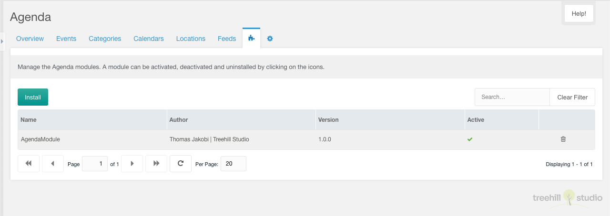

This tab contains a paginated grid with all modules installed in Agenda.

It is only visible to a user who has enabled the `agenda_modules` permission.
The permission check is not executed for sudo users.

A module can be added by entering a package name in lowercase. An installed
module can be activated, deactivated and removed with one click in the context
menu of the module row. The `active` column ‘Active’ can be edited inline and
the trash icon can remove a module. At least the modules can be sorted by drag &
drop.

The creation of custom modules will be described later. Until then, we will
send the code of a skeleton module on demand.
