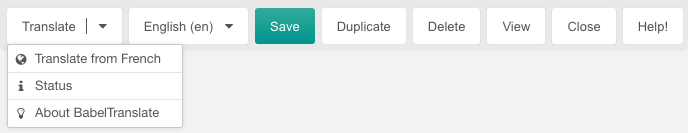

Nach der Installation enthält eine MODX-Ressource eine neue Schaltfläche
Übersetzen. Diese Schaltfläche öffnet ein Menü zum Übersetzen der Ressource.

Der erste Abschnitt des Menüs enthält (falls vorhanden) alle verknüpften
babel-Kontexte und bietet eine Übersetzung aus der Kontextsprache, die mit der
Kontexteinstellung Einstellung `cultureKey` gesetzt wurde.

Der zweite Abschnitt des Menüs enthält einen Menüeintrag, der den Nutzungsstatus
der DeepL API anzeigt.

## Verfügbare Sprachen

Die Liste der Ausgangssprachen wird durch verknüpfte Babel-Ressourcen und deren
`cultureKey`-Einstellung. Die Zielsprache wird mit der `cultureKey`-Einstellung
des aktuellen Ressourcenkontextes festgelegt.

Die folgenden Ausgangs- und Zielsprachen sind derzeit verfügbar. Diese Liste ist
möglicherweise unvollständig. Die aktuellsten Quell- und Zielsprachen finden Sie
auf der Seite [DeepL API Text übersetzen](https://www.deepl.com/de/docs-api/translate-text/translate-text):

### Quellsprachen

| Schlüssel | Sprache                                                 |
|-----------|---------------------------------------------------------|
| `ar`      | Arabisch                                                |
| `bg`      | Bulgarisch                                              |
| `cs`      | Tschechisch                                             |
| `da`      | Dänisch                                                 |
| `de`      | Deutsch                                                 |
| `el`      | Griechisch                                              |
| `en`      | Englisch                                                |
| `es`      | Spanisch                                                |
| `et`      | Estnisch                                                |
| `fi`      | Finnisch                                                |
| `fr`      | Französisch                                             |
| `hu`      | Ungarisch                                               |
| `id`      | Indonesisch                                             |
| `it`      | Italienisch                                             |
| `ja`      | Japanisch                                               |
| `ko`      | Koreanisch                                              |
| `lt`      | Litauisch                                               |
| `lv`      | Lettisch                                                |
| `nb`      | Norwegisch (Bokmål)                                     |
| `nl`      | Niederländisch                                          |
| `pl`      | Polnisch                                                |
| `pt`      | Portugiesisch (alle portugiesischen Varianten gemischt) |
| `ro`      | Rumänisch                                               |
| `ru`      | Russisch                                                |
| `sk`      | Slowakisch                                              |
| `sl`      | Slowenisch                                              |
| `sv`      | Schwedisch                                              |
| `tr`      | Türkisch                                                |
| `uk`      | Ukrainisch                                              |
| `zh`      | Chinesisch                                              |

### Zielsprachen

| Schlüssel | Sprache                                                                                                                   |
|-----------|---------------------------------------------------------------------------------------------------------------------------|
| `ar`      | Arabisch                                                                                                                  |
| `bg`      | Bulgarisch                                                                                                                |
| `cs`      | Tschechisch                                                                                                               |
| `da`      | Dänisch                                                                                                                   |
| `de`      | Deutsch                                                                                                                   |
| `el`      | Griechisch                                                                                                                |
| `en`      | Englisch (nicht spezifizierte Variante für Abwärtskompatibilität; bitte wählen Sie stattdessen `en-GB` oder `en-US`)      |
| `en-GB`   | Englisch (Britisch)                                                                                                       |
| `en-US`   | Englisch (Amerikanisch)                                                                                                   |
| `es`      | Spanisch                                                                                                                  |
| `et`      | Estnisch                                                                                                                  |
| `fi`      | Finnisch                                                                                                                  |
| `fr`      | Französisch                                                                                                               |
| `hu`      | Ungarisch                                                                                                                 |
| `id`      | Indonesisch                                                                                                               |
| `it`      | Italienisch                                                                                                               |
| `ja`      | Japanisch                                                                                                                 |
| `ko`      | Koreanisch                                                                                                                |
| `lt`      | Litauisch                                                                                                                 |
| `lv`      | Lettisch                                                                                                                  |
| `nb`      | Norwegisch (bokmål)                                                                                                       |
| `nl`      | Niederländisch                                                                                                            |
| `pl`      | Polnisch                                                                                                                  |
| `pt`      | Portugiesisch (nicht spezifizierte Variante für Abwärtskompatibilität; bitte wählen Sie stattdessen `pt-BR` oder `pt-PT`) |
| `pt-BR`   | Portugiesisch (Brasilianisch)                                                                                             |
| `pt-PT`   | Portugiesisch (alle portugiesischen Varianten außer brasilianisches Portugiesisch)                                        |
| `ro`      | Rumänisch                                                                                                                 |
| `ru`      | Russisch                                                                                                                  |
| `sk`      | Slowakisch                                                                                                                |
| `sl`      | Slowenisch                                                                                                                |
| `sv`      | Schwedisch                                                                                                                |
| `tr`      | Türkisch                                                                                                                  |
| `uk`      | Ukrainisch                                                                                                                |
| `zh`      | Chinesisch (vereinfacht)                                                                                                  |

Wenn die Zielsprache mehrere Dialekte hat, wird der erste Dialekt in der obigen
Liste automatisch ausgewählt. Wenn z.B. die Übersetzung in `en-US` gewünscht ist
erforderlich ist, kann dies in einer zusätzlichen Kontexteinstellung
`translationKey` angegeben werden. Diese Kontexteinstellung überschreibt die
Kontexteinstellung `cultureKey`.
