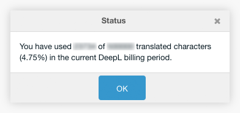

After installation, a MODX resource contains a new Translate button. This button
opens a menu for translating the resource.

The first section of the menu contains (if available) all linked babel contexts
and provides a translation from the context language set with the context
setting `cultureKey`.

The second section of the menu contains a menu entry, that shows the usage
status of the DeepL API.

## Available Languages

The source language list is created by linked Babel resources and their
`cultureKey` setting. The target language is set with the `cultureKey` setting
of the current resoures context.

The following source and target languages are currently available. This list is
maybe incomplete. The latest source and target languages can be found in [DeepL
API Translate
Text](https://www.deepl.com/en/docs-api/translate-text/translate-text):

### Source Languages 

| Key  | Language                                    |
|------|---------------------------------------------|
| `ar` | Arabic                                      |
| `bg` | Bulgarian                                   |
| `cs` | Czech                                       |
| `da` | Danish                                      |
| `de` | German                                      |
| `el` | Greek                                       |
| `en` | English                                     |
| `es` | Spanish                                     |
| `et` | Estonian                                    |
| `fi` | Finnish                                     |
| `fr` | French                                      |
| `hu` | Hungarian                                   |
| `id` | Indonesian                                  |
| `it` | Italian                                     |
| `ja` | Japanese                                    |
| `ko` | Korean                                      |
| `lt` | Lithuanian                                  |
| `lv` | Latvian                                     |
| `nb` | Norwegian (Bokmål)                          |
| `nl` | Dutch                                       |
| `pl` | Polish                                      |
| `pt` | Portuguese (all Portuguese varieties mixed) |
| `ro` | Romanian                                    |
| `ru` | Russian                                     |
| `sk` | Slovak                                      |
| `sl` | Slovenian                                   |
| `sv` | Swedish                                     |
| `tr` | Turkish                                     |
| `uk` | Ukrainian                                   |
| `zh` | Chinese                                     |

### Target Languages

| Key     | Language                                                                                              |
|---------|-------------------------------------------------------------------------------------------------------|
| `ar`    | Arabic                                                                                                |
| `bg`    | Bulgarian                                                                                             |
| `cs`    | Czech                                                                                                 |
| `da`    | Danish                                                                                                |
| `de`    | German                                                                                                |
| `el`    | Greek                                                                                                 |
| `en`    | English (unspecified variant for backward compatibility; please select `en-GB` or `en-US` instead)    |
| `en-GB` | English (British)                                                                                     |
| `en-US` | English (American)                                                                                    |
| `es`    | Spanish                                                                                               |
| `et`    | Estonian                                                                                              |
| `fi`    | Finnish                                                                                               |
| `fr`    | French                                                                                                |
| `hu`    | Hungarian                                                                                             |
| `id`    | Indonesian                                                                                            |
| `it`    | Italian                                                                                               |
| `ja`    | Japanese                                                                                              |
| `ko`    | Korean                                                                                                |
| `lt`    | Lithuanian                                                                                            |
| `lv`    | Latvian                                                                                               |
| `nb`    | Norwegian (bokmål)                                                                                    |
| `nl`    | Dutch                                                                                                 |
| `pl`    | Polish                                                                                                |
| `pt`    | Portuguese (unspecified variant for backward compatibility; please select `pt-BR` or `pt-PT` instead) |
| `pt-BR` | Portuguese (Brazilian)                                                                                |
| `pt-PT` | Portuguese (all Portuguese varieties excluding Brazilian Portuguese)                                  |
| `ro`    | Romanian                                                                                              |
| `ru`    | Russian                                                                                               |
| `sk`    | Slovak                                                                                                |
| `sl`    | Slovenian                                                                                             |
| `sv`    | Swedish                                                                                               |
| `tr`    | Turkish                                                                                               |
| `uk`    | Ukrainian                                                                                             |
| `zh`    | Chinese (simplified)                                                                                  |

If the target language has multiple dialects, the first dialect in the above
list is automatically selected. If, for example, translation to `en-US` is
required, then this can be specified in an additional context setting
`translationKey`. This context setting overwrites the `cultureKey` context
setting.
