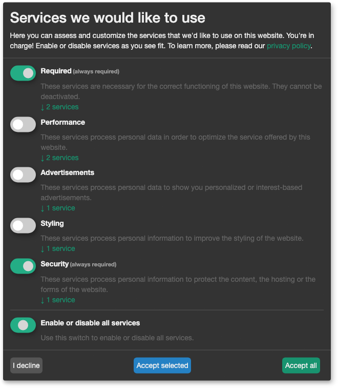

ConsentFriend verwendet das Open-Source-Skript von
[Klaro!](https://kiprotect.com/klaro) als Skript zur Verwaltung von
Einwilligungen auf dem Frontend. Das Klaro!-Skript aktiviert automatisch interne
und externe Dienste auf der Webseite. ConsentFriend bereitet den HTML-Code der
Seite vor, so dass die automatische Ausführung oder das Laden von externen
Diensten per Klaro!-Script gesteuert werden kann.



> **Die folgenden Schritte werden von ConsentFriend automatisch vorbereitet** 
>
> Um sicherzustellen, dass keine Tracking-Skripte und Dienste Dritter ohne
Zustimmung geladen werden, muss der HTML-Code der Seite geändert werden: Bei
Skripten muss das type-Attribut auf `type="text/plain"` gesetzt oder durch
`type="text/plain"` ersetzt werden (dies verhindert, dass der Browser das Skript
ausführt) und ein data-Attribut mit dem ursprünglichen Typ hinzugefügt werden,
d.h. `data-type="application/javascript"`. Außerdem muss ein data-name-Attribut
hinzugefügt werden, das mit dem Namen des [Dienstes in der Managerseite]
(../03_Custom_Manager_Page/01_Services.md#service-name) übereinstimmen muss,
d.h. `data-name="matomo"`.

Wenn man den Code des externen Dienstes in der ConsentFriend-Dienstkonfiguration
eingegeben wird, dann wird der Code für die automatische Aktivierung
vorbereitet. ConsentFriend fügt anschließend den vorbereiteten Code am Ende des
HEAD- oder BODY-Abschnitts in den HTML-Code ein.

> **Kommerzielle Version von Klaro!**
>
> ConsentFriend nutzt die kommerzielle serverseitige Version von Klaro! nicht.
Es ist nicht erforderlich und derzeit auch nicht möglich, die kommerzielle
Version von Klaro! mit ConsentFriend zu verwenden.

## Benutzerdefinierte externe Dienste

Wenn externe Dienste inline auf der Seite platzieren werden, dann muss die
Vorbereitung des Codes selbst vorgenommen werden. Externe Dienste können z.B.
durch `script`, `img`, `link` oder `iframe` Tags aufgerufen werden. Alle diese
Tags müssen ein `data-name`-Attribut enthalten, das mit dem Namen eines
[Dienst](../03_Custom_Manager_Page/01_Services.md#service-name) von
ConsentFriend übereinstimmt, z.B. `data-name="matomo"`. Enthält der
ursprüngliche Tag ein type Attribut, muss es in `type="text/plain"` geändert
werden.

### Skript-Tags

Dienste mit einem Skript-Tag benötigen ein zusätzliches Attribut `data-type` mit
dem ursprünglichen Typ, d.h. `data-type="application/javascript"`. Wenn der
Dienst ein externes Skript über das Attribut `src` referenziert, muss dieses
Attribut mit `data-src` umbenannt werden.

### iframe und img Tags

Dienste mit einem iframe- oder img-Tag benötigen ein zusätzliches
`data-src`-Attribut mit dem ursprünglichen src, z.B.
`data-src="https://www.youtube.com/embed/M7lc1UVf-VE"`. Das ursprüngliche
src-Attribut muss entfernt werden. Da das type-Attribut für iframe-Tags nicht
gültig ist, kann es dort entfernt werden.

ConsentFriend blendet einen iframe-basierten Dienst aus und zeigt einen
Platzhalter mit mit einer Aktivierungsschaltfläche an. Diese Funktion nennt sich
[Contextual Consent](03_Contextual_Consent.md) und wird seit ConsentFriend 1.2.0
verwendet.

### Link-Tags

Dienste mit einem Link-Tag benötigen ein zusätzliches `data-href`-Attribut mit
dem ursprünglichen href, z.B.
`data-href="https://fonts.googleapis.com/css2?family=Open+Sans"`. Das
ursprüngliche href-Attribut muss entfernt werden.

## Standard-Dienste

ConsentFriend installiert verschiedene
[Standard-Dienste](02_Default_Services.md). Einige von ihnen
verwenden System-/Kontext Einstellungen, die Sie selbst anlegen müssen.

## Beispiele

Beispielcode für externe Dienste:

- [Google Maps](Google_Maps.md)
- [Google reCAPTCHA](Google_reCAPTCHA.md)
- [Google Tag Manager](Google_Tag_Manager.md)
- [Youtube videos](Youtube_Videos.md)

#### Link zum Öffnen des Einverständnisverwaltungsfensters

Um einen Link zum Zustimmungsmanagement-Fenster auf einer Seite hinzuzufügen,
ist der folgende Code notwendig:

```html
<a onclick="klaro.show();return false;">
    [[%consentfriend.services.change_setting? &namespace=`consentfriend`]]
</a>
```
