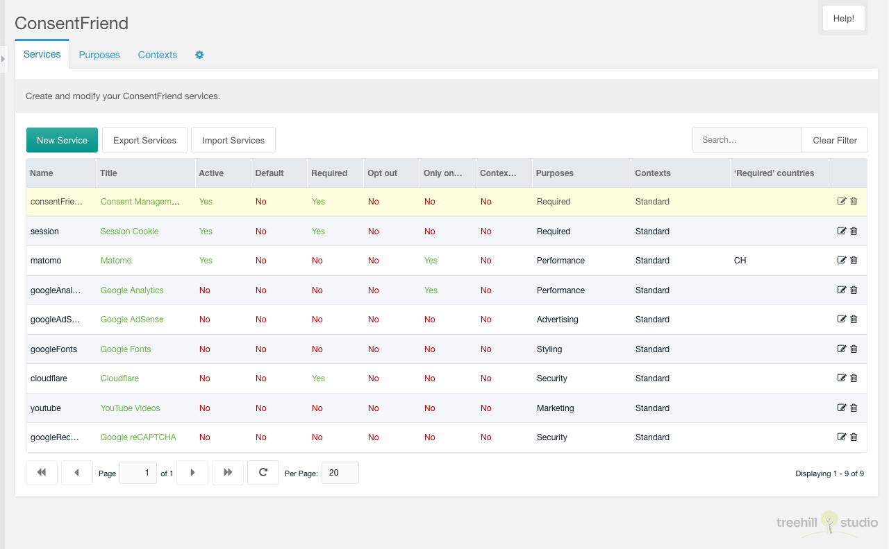
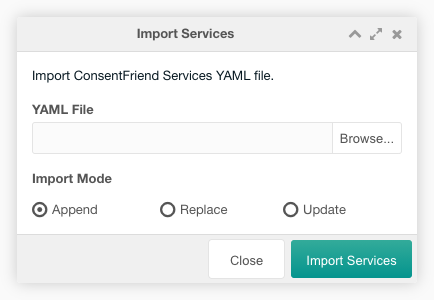
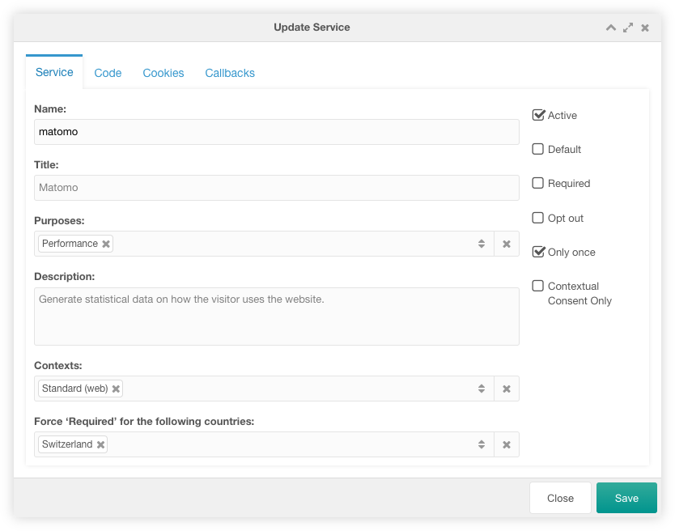
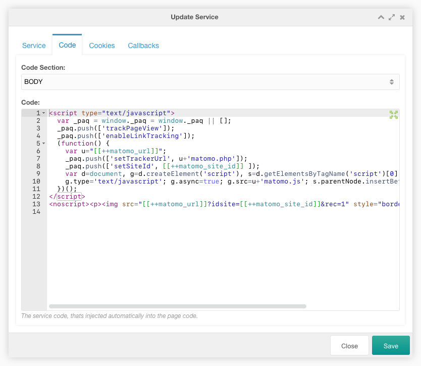
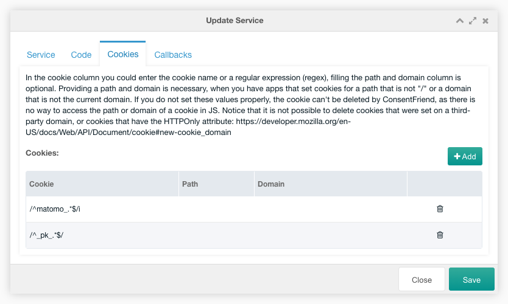
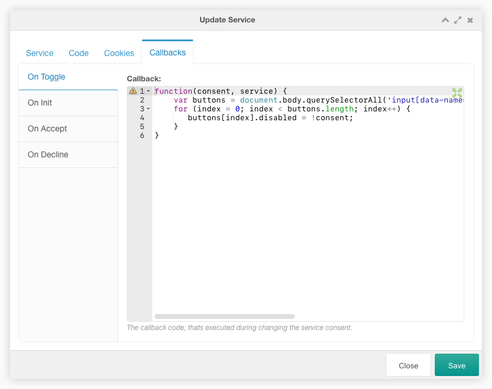

Diese Registerkarte enthält eine paginierte Tabelle mit allen internen oder
externen Diensten, die persönliche Daten sammeln können.

Mit ConsentFriend können Sie sowohl Inline- und externe Skripte als auch
statische Tracking-Elemente wie Bilder oder Stylesheet-Links verwalten. Neue
Dienste können mit nur wenigen Zeilen Code hinzugefügt werden.

Sie können einen neuen Dienst mit einem Klick auf die Schaltfläche „Neuer
Dienst“ oben links über der Dienste-Tabelle erstellen.

Sie können die Dienste in eine YAML-Datei exportieren, indem Sie auf die
Schaltfläche „Dienste exportieren“ oberhalb der Dienste-Tabelle klicken.

Sie können eine YAML-Datei mit den Diensten importieren, indem Sie auf die
Schaltfläche „Dienste importieren“ oberhalb der Dienste-Tabelle klicken. Im
Importfenster wählen Sie eine zu importierende Datei und den Importmodus aus. Im
Modus Anhängen werden die Einträge in der Datei an die bestehenden Dienste im
Grid angehängt. Im Ersetzen-Modus werden die vorhandenen Dienste in der Tabelle
durch die Einträge in der Datei ersetzt. Im Aktualisierungsmodus werden die
vorhandenen Dienste in der Tabelle mit den Einträgen in der Datei aktualisiert.

Die Tabelle kann durch eine Sucheingabe oben rechts über der Dienste-Tabelle
gefiltert werden.

Jeder Dienst kann durch einen Klick auf das Bearbeitungssymbol in der Zeile des
Dienstes bearbeitet werden. Und er kann nach einer Bestätigung mit einem Klick
auf das Papierkorbsymbol in der Zeile des Dienstes gelöscht werden. Der
Servicename und die Ja/Nein-Spalten sind inline editierbar.

Die Zeile jedes Dienstes zeigt den Namen des Dienstes, den Titel, einige
Optionen, den Zweck und optional den Kontext und/oder die „erforderlichen“
Länder. Der Titel des Dienstes wird in grün angezeigt, wenn er aus einem Lexikon
abgerufen wird. Er wird in rot angezeigt, wenn kein Lexikoneintrag vorhanden
ist.

## Erstellen/Bearbeiten

Das Fenster "Erstellen/Bearbeiten" ermöglicht es dem Benutzer, die
Dienstoptionen auf drei Registerkarten zu bearbeiten.

### Registerkarte "Dienst"

In der Registerkarte "Dienst" müssen Sie den Namen, den Titel und die
Beschreibungen festlegen. Sie können den Zweck des Dienstes und die
Dienstoptionen wie Aktiv, Standard, Erforderlich, Abmelden und Nur einmal
auswählen.

**Name:** (Erforderlich) Jeder Dienst muss einen eindeutigen Namen haben.
ConsentFriend sucht nach HTML-Elementen mit einem passenden
"data-name"-Attribut, um Elemente zu identifizieren, die zu diesem Dienst
gehören.

**Titel:** Der Titel Ihres Dienstes, wie er im Zustimmungsmodal aufgeführt ist.
Wenn die Beschreibung leer gelassen wird, wird der Titel durch den
Lexikoneintrag "consentfriend.services.<name>.title" im consentfriend-Namensraum
festgelegt.

**Zwecke:** Der/die Zweck(e) dieses Dienstes, der in der Einwilligungserklärung
aufgeführt wird. Vergessen Sie nicht, Übersetzungen für alle Zwecke, die Sie
hier auflisten, hinzuzufügen.

**Beschreibung:** Die Beschreibung des Dienstes, wie sie im
Einwilligungsformular aufgeführt ist. Wenn die Beschreibung leer gelassen wird,
wird die Beschreibung durch den Lexikoneintrag
"consentfriend.services.<name>.description" im consentfriend-Namensraum
festgelegt.

**Kontexte:** Der/die Kontext(e), in dem/denen dieser Dienst im Frontend aktiv
ist. Verfügbar seit ConsentFriend 1.5.0.

**"Erforderlich" erzwingen für die folgenden Länder:** Die Länder, in denen
dieser Dienst im Frontend auf "erforderlich" gesetzt ist. Wenn das Land des
Besuchers in dieser Liste gefunden wird, wird der Dienst vorübergehend in den
Zweck `functional` verschoben und "Standard" und "Erforderlich" sind für den Dienst
aktiviert. Verfügbar seit ConsentFriend 1.7.0.

**Aktiv:** Wenn "aktiv" angekreuzt ist, wird der Dienst im Fenster der
Einwilligungsverwaltung angezeigt.

**Standard:** Wenn "Standard" angekreuzt ist, wird der Dienst standardmäßig
aktiviert. Dies setzt die globale Einstellung "Standard" außer Kraft.';

**Erforderlich:** Wenn "erforderlich" markiert ist, lässt ConsentFriend nicht
zu, dass dieser Dienst vom Benutzer deaktiviert wird. Verwenden Sie dies für
Dienste, die für das Funktionieren Ihrer Website immer erforderlich sind (z.B.
Cookies für den Warenkorb).';

**Abmelden:** Wenn "Opt out" angekreuzt ist, lädt ConsentFriend diesen Dienst
auch dann, wenn der Nutzer noch nicht ausdrücklich zugestimmt hat. Davon raten
wir dringend ab.

**Nur einmal:** Wenn "onlyOnce" angekreuzt ist, wird der Dienst nur einmal
ausgeführt, unabhängig davon, wie oft der Nutzer ihn ein- und ausschaltet. Dies
ist z. B. für Tracking-Skripte relevant, die jedes Mal neue Seitenaufrufe
erzeugen würden, wenn ConsentFriend sie aufgrund einer Änderung der Zustimmung
des Nutzers deaktiviert und wieder aktiviert.

**Nur kontextbezogene Zustimmung:** Wenn die Option "Nur kontextbezogene
Zustimmung" aktiviert ist, kann der Dienst nicht direkt global mit dem Workflow
"Alle akzeptieren" im Zustimmungsmodal aktiviert werden. Der Dienst wird
weiterhin durch einen Platzhalter verborgen, aber es wird eine zweite
Schaltfläche angezeigt, über die der Benutzer den Dienst global aktivieren kann.

### Registerkarte "Code"

Auf der Registerkarte "Code" können Sie den Codeabschnitt auswählen und den
Servicecode eingeben.

**Code-Abschnitt:** Der Abschnitt des Seitencodes, in den der Servicecode eingefügt
wird.

**Code:** Der Servicecode, der automatisch in den Seitencode eingefügt wird. Der
Servicecode wird automatisch für eine direkte Ausführung vor der Injektion
deaktiviert. MODX Kontext/Systemeinstellungen Tags können im Service Code
verwendet werden.

### Registerkarte "Cookies"

Auf der Registerkarte "Cookies" können Sie die Cookies des Dienstes in einem
Raster bearbeiten. Das Hinzufügen der Cookies eines Dienstes ermöglicht es
ConsentFriend, die Cookies dieses Dienstes zu löschen, wenn der Dienst
deaktiviert wird.

Einige Beispiel-Cookie-Einstellungen findest du in den Demodaten, die während
der ConsentFriend-Installation installiert werden.

Sie können eine neue Cookie-Einstellung mit einem Klick auf den Hinzufügen-Button
oben rechts über dem Cookie-Raster erstellen.

Jede Cookie-Einstellung kann inline in der Tabelle bearbeitet werden. Sie kann
nach einer Bestätigung mit einem Klick auf das Zahnradsymbol in der Zeile des
Dienstes gelöscht werden.

In der Cookie-Spalte können Sie den Cookie-Namen oder einen regulären Ausdruck
(regex) eingeben, das Ausfüllen der Pfad- und Domänenspalte ist optional. Die
Angabe von Pfad und Domäne ist notwendig, wenn Sie Anwendungen haben, die
Cookies für einen Pfad setzen, der nicht "/" ist, oder eine Domäne, die nicht
die aktuelle Domäne ist. Wenn Sie diese Werte nicht korrekt angeben, kann das
Cookie nicht von ConsentFriend gelöscht werden, da es keine Möglichkeit gibt,
auf den Pfad oder die Domäne eines Cookies in JS zuzugreifen. Beachten Sie, dass
es nicht möglich ist, Cookies zu löschen, die auf einer fremden Domäne gesetzt
wurden, oder Cookies, die das Attribut HTTPOnly haben. [Siehe
Dokumentation](https://developer.mozilla.org/en-US/docs/Web/API/Document/cookie#new-cookie_domain)

### Registerkarte "Callbacks"

Auf der Registerkarte "Callbacks" können Sie in den Textbereichen der vier
Callbacks-Registerkarten verschiedene Service-Callbacks eingeben.

**On Toggle:** Dieser Callback-Code wird ausgeführt, wenn die Zustimmung
zum Dienst geändert wird. Er muss eine Javascript-Funktion mit den beiden
Eigenschaften consent und service enthalten oder leer bleiben. consent enthält
den Zustimmungsstatus (true = zugestimmt) und service enthält die
Dienstkonfiguration.

Die Demodaten des googleRecaptcha-Dienstes enthalten ein Codebeispiel, das alle
Eingaben mit data-name="googleRecaptcha" deaktiviert. Bitte sehen Sie sich das
[reCAPTCHA Anwendungsbeispiel](../02_Functionality/Google_reCAPTCHA.md) an.

Der On Toggle Callback wurde vor ConsentFriend 1.3.0 Callback genannt. Die
folgenden Callbacks sind seit ConsentFriend 1.3.0 verfügbar.

**On Init:** Dieser Callback-Code wird ausgeführt, wenn der Dienst initialisiert
wird (einmal pro Seitenladevorgang). Er muss eine Javascript-Funktion mit der
Eigenschaft opts enthalten oder leer bleiben. opts enthält die Konfiguration des
ConsentFriend-Skripts in opts.config, die Service-Konfiguration in opts.service
und eine optionale Konfiguration in opts.vars. Hier können Sie zusätzliche
Variablen erstellen, die später in den On Accept und On Decline Callbacks
verwendet werden.

**On Accept:** Dieser Callback-Code wird ausgeführt, wenn der Dienst
akzeptiert wird. Er muss eine Javascript-Funktion mit der Eigenschaft opts
(siehe On Init callback) enthalten oder leer bleiben.

**On Decline:** Dieser Callback-Code wird ausgeführt, wenn der Dienst
abgelehnt wird. Er muss eine Javascript-Funktion mit der Eigenschaft opts (siehe
On Init callback) enthalten oder leer bleiben.

Die Demodaten des googleTagManager-Dienstes enthalten Codebeispiele für die drei
oben genannten Callbacks, die den neuen Google Tag Manager Consent Mode
verwenden. Er lädt das Google Analytics-Tag über den Google Tag Manager, aber
nur, wenn Sie der Verwendung von Google Analytics über ConsentFriend zugestimmt
haben. Bitte sehen Sie sich das Beispiel für die [Verwendung von Google Tag
Manager](../02_Functionality/Google_Tag_Manager.md) an.
