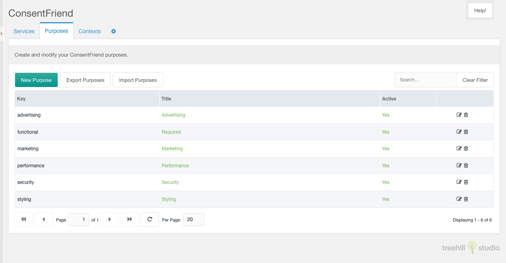
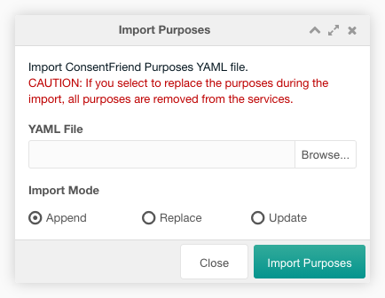
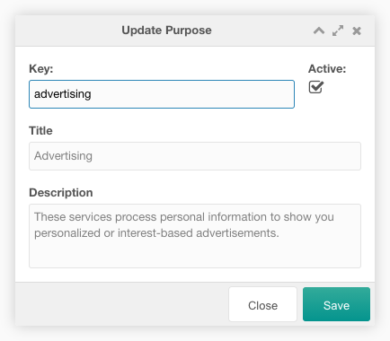

Diese Registerkarte enthält eine paginierte Tabelle mit allen Zwecken. Die
Zwecke werden verwendet, um das Zustimmungsmodal im Frontend zu gruppieren, wenn
die [Systemeinstellung](../04_System_Settings.md)
`consentfriend.group_by_purpose` aktiviert ist.

Sie können einen neuen Zweck erstellen, indem Sie auf die Schaltfläche „Neuer
Zweck“ oben links über der Zweck-Tabelle klicken.

Sie können die Zwecke in eine YAML-Datei exportieren, indem Sie auf die
Schaltfläche "Zwecke exportieren" oberhalb der Zweck-Tabelle klicken.

Sie können eine YAML-Datei mit den Zwecken importieren, indem Sie auf die
Schaltfläche "Zwecke Importieren" oberhalb der Zweck-Tabelle klicken. Im
Importfenster wählen Sie eine zu importierende Datei und den Importmodus aus. Im
Modus "Anhängen" werden die Einträge in der Datei an die bestehenden Zwecke in
der Tabelle angehängt. Im Modus "Ersetzen" werden die vorhandenen Zwecke in der
Tabelle durch die Einträge in der Datei ersetzt. Im Modus "Aktualisieren" werden
die vorhandenen Zwecke in der Tabelle durch die Einträge in der Datei
aktualisiert.

Die Tabelle kann durch eine Sucheingabe oben rechts über der Zweck-Tabelle
gefiltert werden.

Jeder Zweck kann durch einen Klick auf das Bearbeitungssymbol in der Zeile des
Zwecks bearbeitet werden. Und er kann nach einer Bestätigung mit einem Klick auf
das Papierkorbsymbol in der Zeile des Zwecks gelöscht werden. Der Zweck-Schlüssel
und die Spalte "Aktiv" sind inline editierbar.

Die Zeile eines jeden Zwecks zeigt den Schlüssel, den Titel und den aktiven
Status eines Eintrags an.

## Erstellen/Bearbeiten

Im Fenster "Erstellen/Bearbeiten" kann der Benutzer die Zweckoptionen
bearbeiten.

Sie können den Zwecknamen und den Zweck-Alias festlegen und den Zweck inaktiv
schalten.

