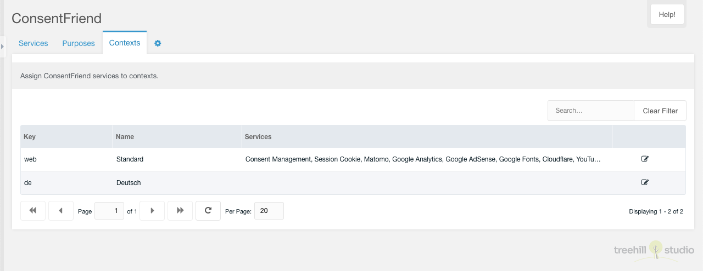
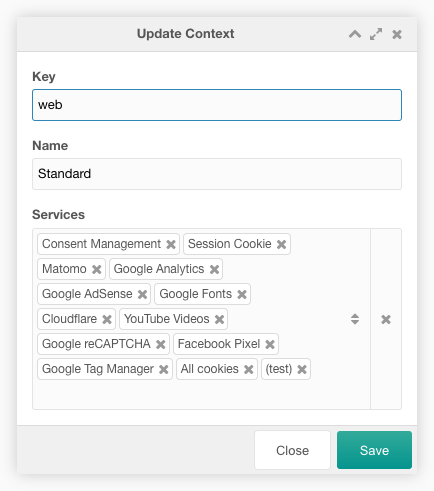

Diese Registerkarte enthält eine paginierte Tabelle mit allen Kontexten außer dem
mgr-Kontext. Sie ist nur sichtbar, wenn die MODX-Systemeinstellung
`consentfriend.use_contexts` aktiviert ist.

Jeder Kontext kann durch einen Klick auf das Bearbeitungssymbol in der Zeile des
Kontextes bearbeitet werden.

Die Zeile jedes Kontexts zeigt den Kontextschlüssel, den Namen und die aktiven
Dienste an.

## Bearbeiten

Das Bearbeitungsfenster ermöglicht dem Benutzer, die Kontextdienste zu
bearbeiten.

Sie können die verfügbaren Dienste im Combo-Feld Dienste zuweisen und
entfernen.
