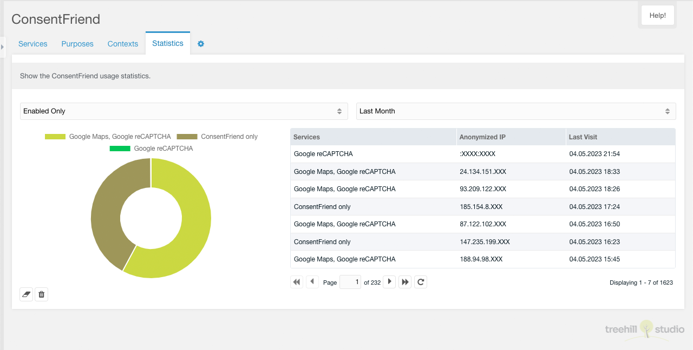

Diese Registerkarte enthält die ConsentFriend-Statistiken. Sie ist nur sichtbar,
wenn die MODX Systemeinstellung `consentfriend.log_usage` aktiviert ist.

Nach der Aktivierung wird die Nutzung von ConsentFriend im Frontend mit einer
anonymisierten IP, dem Browser-Agenten, dem Zugriffsdatum und den aktivierten
Diensten protokolliert. Die Ergebnisse dieser Protokollierung werden auf dieser
Registerkarte angezeigt.
