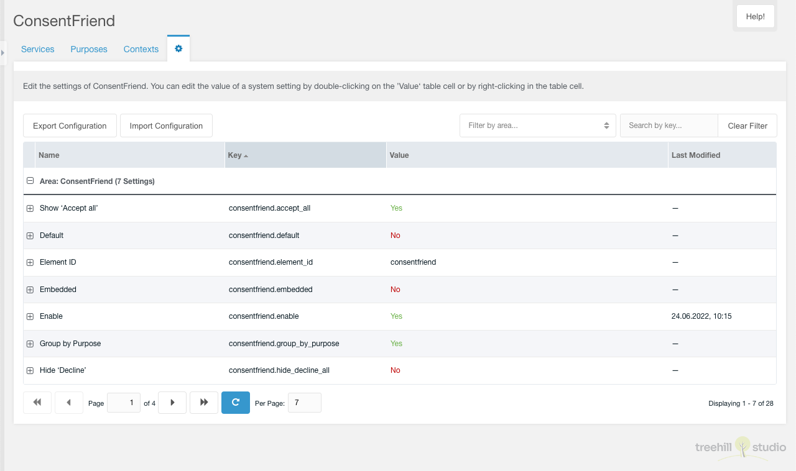
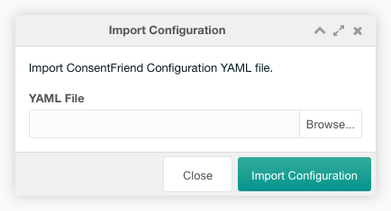

Diese Registerkarte enthält eine paginierte Tabelle mit allen
[Einstellungen](../04_System_Settings.md) des Namensraums consentfriend.

Sie ist nur für einen Benutzer sichtbar, der das Recht `setting` oder
`consentfriend_setting` aktiviert hat. Jede Einstellung kann auf die gleiche
Weise wie in den MODX-Systemeinstellungen bearbeitet werden.

Hier können Sie die ConsentFriend-Konfiguration (Dienste, Zwecke,
Systemeinstellungen) in eine YAML-Datei exportieren, indem Sie auf die
Schaltfläche "Konfiguration exportieren" oberhalb des Zweck-Tabelle klicken.

Sie können eine YAML-Datei mit der vollständigen ConsentFriend-Konfiguration
importieren, indem Sie auf die Schaltfläche "Konfiguration importieren" oberhalb
des Einstellungstabelle klicken. Im Importfenster müssen Sie eine Datei
auswählen, die Sie importieren möchten.

Diese ConsentFriend-Konfigurationsdatei kann vor der Installation des
ConsentFriend-Pakets in `{core_path}config/consentfriend/setup.yaml` hochgeladen
werden. Dann wird der Inhalt der Datei als Erstkonfiguration von ConsentFriend
vorbereitet. Wenn Sie später nur einen Dienst hinzufügen möchten, erstellen Sie
eine `{core_path}config/consentfriend/append.yaml` Datei mit diesem Dienst und
der Inhalt der Datei wird an die ConsentFriend Einstellungen angehängt.
