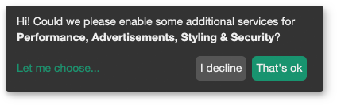
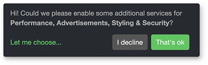
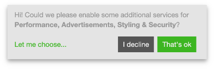
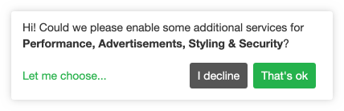

_ConsentFriend_ hat fünf verschiedene Standardthemen, die in den
[Systemeinstellungen](04_System_Settings.md).

Die Standardthemen sehen wie folgt aus:

**default (oder leer)**



**black**


**dark**



**light**



**white**



## Ändern des aktiven Themas

Das momentan aktive Thema kann durch css-Variablen geändert werden. Die [klaro
Variablen](https://github.com/kiprotect/klaro/blob/master/src/scss/vars.scss#L71-L113)
sind mit dem Präfix `consentfriend-` verfügbar. Sie müssen z.B. die Variable
`--consentfriend-dark1` für die Hintergrundfarbe des Modals in Ihrem css ändern.
Die folgenden Zeilen erzeugen einen weißen Hintergrund für das Modal:

```css
:root {
  --consentfriend-dark1: #fff;
}
```

### Variablen der ConsentFriend-Themen

Die _ConsentFriend_-Themen verwenden die folgenden Variablen (und einige
zusätzliche Modifikationen für die Schatten des Modals, die nicht durch
Variablen geändert werden können):

**black**

```css
:root {
  --consentfriend-border-radius: 1px;
  --consentfriend-dark1: #060606;
  --consentfriend-dark2: #515151;
  --consentfriend-dark3: #858585;
  --consentfriend-white1: #999;
  --consentfriend-white2: #ccc;
  --consentfriend-white3: #fff;
  --consentfriend-blue1: #2d9fd6;
  --consentfriend-green1: #77b300;
  --consentfriend-red1: #c00;
}
```

**dark**

```css
:root {
  --consentfriend-border-radius: 4px;
  --consentfriend-dark1: #272b30;
  --consentfriend-dark2: #606a76;
  --consentfriend-dark3: #8d96a2;
  --consentfriend-white1: #999;
  --consentfriend-white2: #ccc;
  --consentfriend-white3: #fff;
  --consentfriend-blue1: #5bc0de;
  --consentfriend-green1: #62c462;
  --consentfriend-red1: #ee5f5b;
}
```

**light**

```css
:root {
  --consentfriend-border-radius: 0;
  --consentfriend-light1: #555;
  --consentfriend-dark1: #e4e4e4;
  --consentfriend-dark2: #555;
  --consentfriend-dark3: #777;
  --consentfriend-white1: #999;
  --consentfriend-white2: #ccc;
  --consentfriend-white3: #fff;
  --consentfriend-blue1: #446e9b;
  --consentfriend-green1: #3cb521;
  --consentfriend-red1: #cd0200;
}
```

**white**

```css
:root {
  --consentfriend-border-radius: 3px;
  --consentfriend-light1: #333;
  --consentfriend-dark1: #fff;
  --consentfriend-dark2: #555;
  --consentfriend-dark3: #555;
  --consentfriend-white1: #999;
  --consentfriend-white2: #ccc;
  --consentfriend-white3: #fff;
  --consentfriend-blue1: #369;
  --consentfriend-green1: #22b24c;
  --consentfriend-red1: #eb6864;
}
```

## Eigenes Thema erstellen

Wenn Sie Ihr eigenes Thema erstellen möchten, können Sie die Datei
`assets/components/consentfriend/scss/klaro.scss` in Ihren scss-Workflow
importieren. Um das Standard-Styling des Modals nachträglich zu deaktivieren,
setzen Sie bitte die Systemeinstellung `consentfriend.js_url` auf
`/assets/components/consentfriend/js/web/consentfriend-no-css.js`.

Die scss-Variablen haben sich mit der Version 1.3.0 im Open-Source-Teil von
Klaro geändert. Leider sind die Änderungen nicht rückwärtskompatibel. Wenn Sie
ein eigenes Thema erstellt haben, müssen Sie die neuen Farbvariablen verwenden.
Bitte überprüfen Sie die Anzeige des Einwilligungs-Popups nach dem Update und
nach dem Kompilieren der scss-Datei für Ihre Seite.
