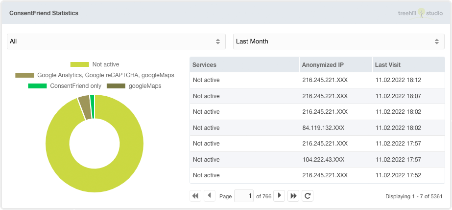

ConsentFriend enthält seit Version 1.4.0 ein Dashboard-Widget.

Um dieses Widget nutzen zu können, müssen Sie die Systemeinstellung
`consentfriend.log_usage` aktivieren. Danach wird die Frontend-Nutzung von
ConsentFriend mit einer anonymisierten IP, dem Browser-Agent, dem Zugriffsdatum
und dem aktivierten Diensten protokolliert. Das Widget kann an beliebiger Stelle
auf dem MODX Dashboard platziert werden.
