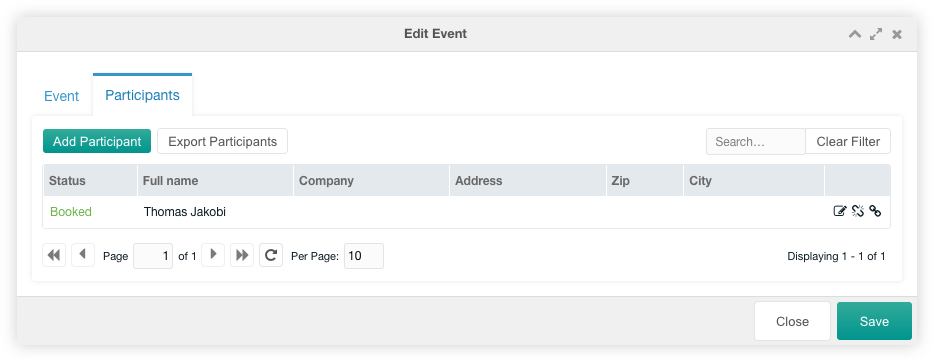

This tab contains a paginated grid with all future (or past) events.

The events are created in Agenda and all event dates are listed here according
to the xPDO where clause in the `cursus.event_where` system setting.

If the user has the `cursus_export_events` permission, the `Export Events`
button is displayed at the top left above the grid. The user can
[export](../08_Export.md) the events with by clicking on the button.

The event dates can be filtered by the Agenda event, by the event status, by
future or past events and by a text input.

The event dates in the grid are displayed with differend background colors:
yellow - empty event date, green - available event date, blue - minimum
participants reached, red - maximum participants reached. Event dates with a
striped background have at least one reserved participant assigned. Event dates
with a solid background have only booked participants or no participant
assigned.

Each event date can be edited by a click on the edit icon displayed in an event
row. The original Agenda event can be edited with a click on the calendar icon
displayed in an event row.

## Edit

The edit window for one event date has some options, that can be changed for
the current event date.

### Event Tab

In the event tab you can change minimum and maximum participants, the published
state, the latest registration, the trainer and the location. The other fields
in that tab are read only. If the [extended participant
fields](../07_Extended_Fields.md) are set, these extended fields are shown at
the bottom of the window.

### Participants Tab

In the participants tab you could view the participants of the current event
date. You can add, edit, remove and reassign each participant with a click on an
icon in the row. If you have set `cursus.extended_event_participant_fields`,
these extended fields are shown at the bottom of the window.

The grid can be filtered by a search input on the top right above the
participants grid.

#### Add Participant

If you add a participant you are able to select an existing participant (of
other events) or add a new participant by entering new data. If you select an
existing participant and edit one of its fields it will be added as a new
participant. You have to edit the participant data in the [Participants
Tab](02_Participants.md) of the custom manager page.

#### Edit Participant

If you edit a participant, you can set the status of the participant for the
current event.

It is also possible to remove a participant from an event after a confirmation
or to reassign the participant to another event.
