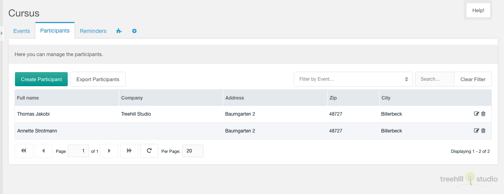
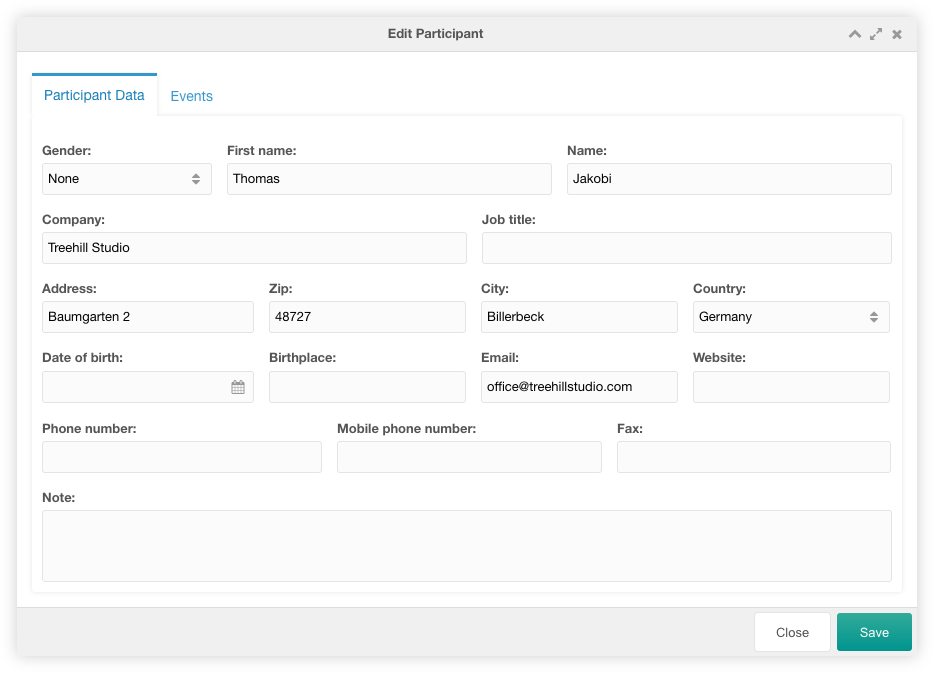
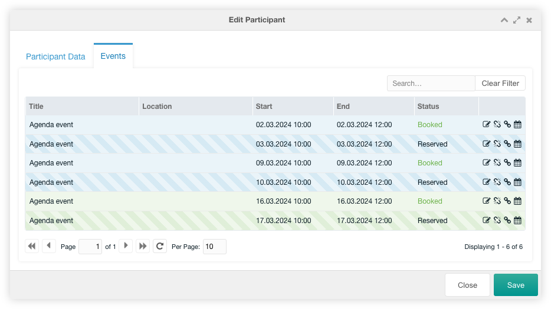

This tab contains a paginated grid with all participants.

You can create a new participant with a click on the create participant button
on the top left above the participants grid.

If the manger user has a `cursus_export_participants` permission an export is
displayed right of the create participant button. This allows the user to
[export](../08_Export.md) the participants.

It can be filtered by events. It can also be filtered by a search entry at the
top right above the participants grid.

The row of each participant shows the fullname, the company, the adddress, the
zip and the city of an entry. If the [extended user
fields](../07_Extended_Fields.md) are set, the columns of those extended fields
are shown before the icon column.

Each participant can be edited by clicking on the edit icon in the participant's
row. It can be deleted after confirmation by clicking on the trash icon in the
row of the participant.

## Create/Edit

The edit window for one participant has a lot of fields, that can be changed.

### Participant Data Tab

In the participant data tab you can change all data of a participant user. If
the [extended user fields](../07_Extended_Fields.md) are set, these extended
fields are shown at the bottom of the window.

### Events Tab

In the events tab you could view the events of the current participant user. You
can edit, remove and reassign each participant with a click on an icon in the
row. If you click on the calendar icon, the linked event is opened in Agenda for
editing.

The grid can be filtered by a search input on the top right above the
participants grid.
