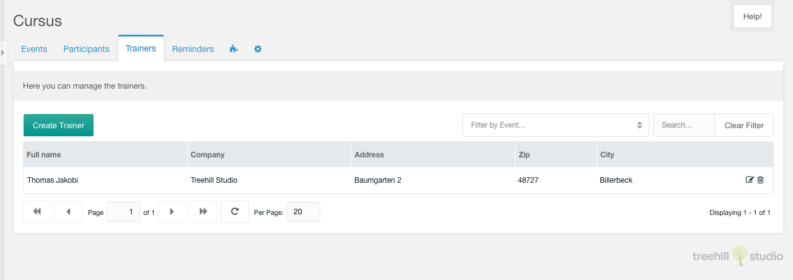
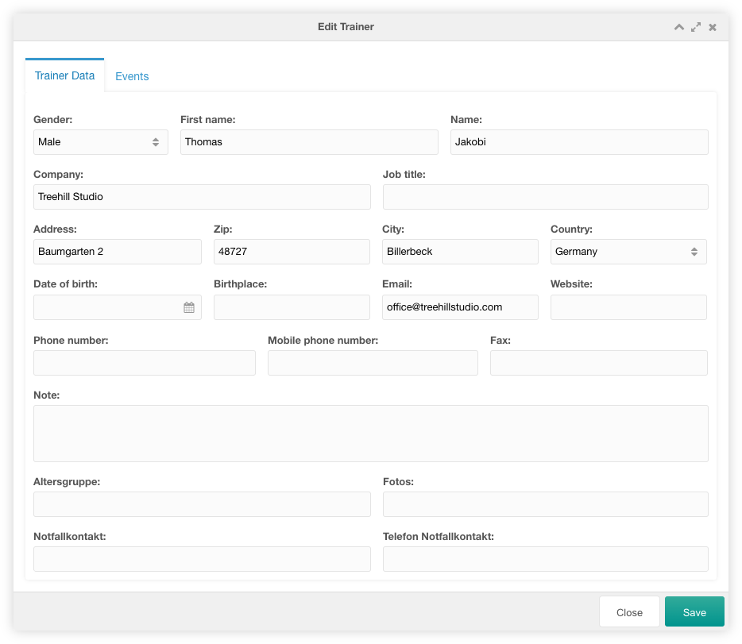
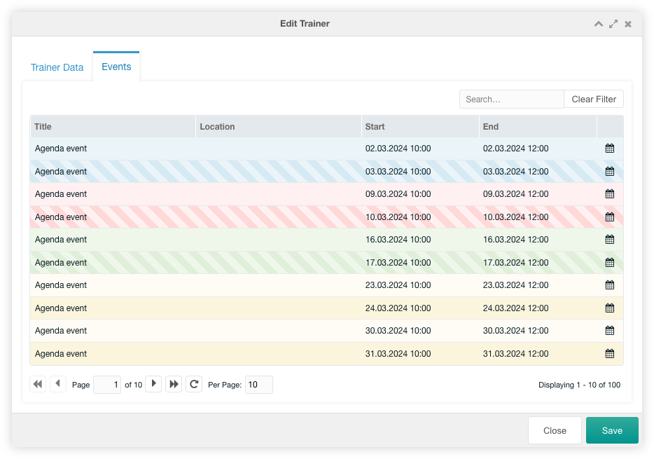

This tab contains a paginated grid with all trainers. It is only visible, when
the [system setting](07_Settings.md) `cursus.show_trainer` is enabled.

You can create a new trainer with a click on the create trainer button
on the top left above the trainers grid.

If the manger user has a `cursus_export_trainers` permission an export is
displayed right of the create trainer button. This allows the user to
[export](../08_Export.md) the trainers.

The grid can be filtered by events. It can also be filtered by a search entry at
the top right above the trainers grid.

The row of each trainer shows the fullname, the company, the adddress, the
zip and the city of an entry. If the [extended user
fields](../07_Extended_Fields.md) are set, the columns of those extended fields
are shown before the icon column.

Each trainer can be edited by clicking on the edit icon in the trainer's
row. It can be deleted after confirmation by clicking on the trash icon in the
row of the trainer.

## Create/Edit

The edit window for one trainer has a lot of fields, that can be changed.

### Trainer Data Tab

In the trainer data tab you can change all data of a trainer user. If
the [extended user fields](../07_Extended_Fields.md) are set, these extended
fields are shown at the bottom of the window.

### Events Tab

In the events tab you could view the events of the current trainer user. If you
click on the calendar icon, the linked event is opened in Agenda for editing.

The grid can be filtered by a search input on the top right above the
trainers grid.
