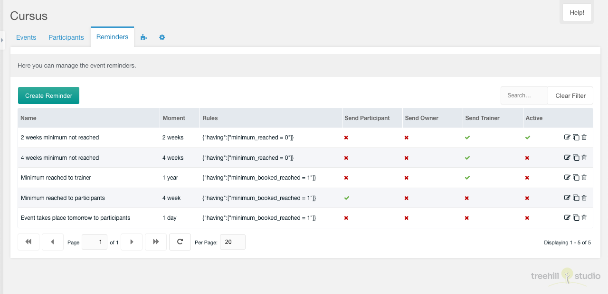
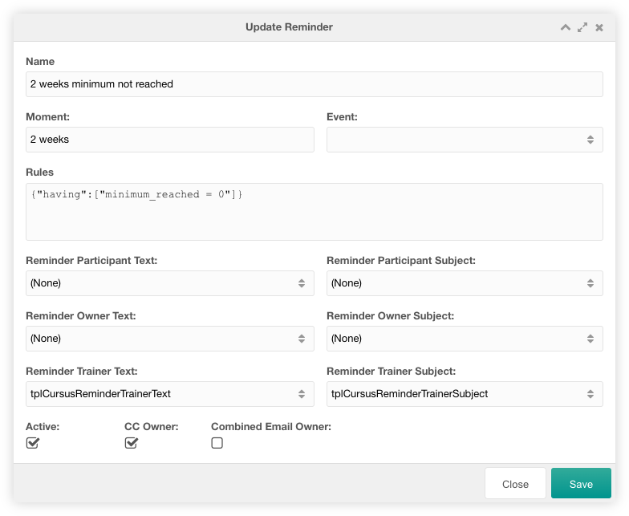

This tab contains a paginated grid with all reminders. It is only visible for a
user that has the `cursus_reminders` permission enabled. The permission check is
not executed for sudo users.

You can create a new reminder with a click on the create reminder button
on the top left above the reminders grid.

The grid can be filtered by a search entry at the top right above the reminders
grid.

The row of each reminder shows the fullname, the company, the adddress, the
zip and the city of an entry. If the [extended user
fields](../07_Extended_Fields.md) are set, the columns of those extended fields
are shown before the icon column.

Each reminder can be edited by clicking the edit icon in the row of the
reminder. It can be duplicated by clicking the duplicate icon in the row of the
reminder row. It can be deleted after confirmation by clicking on the trash icon
in the row of the reminder.

## Create/Edit

The edit window for one reminder has a lot of fields, that can be changed.

In the reminder data tab you can change all data of a reminder user. If
the [extended user fields](../07_Extended_Fields.md) are set, these extended
fields are shown at the bottom of the window.

