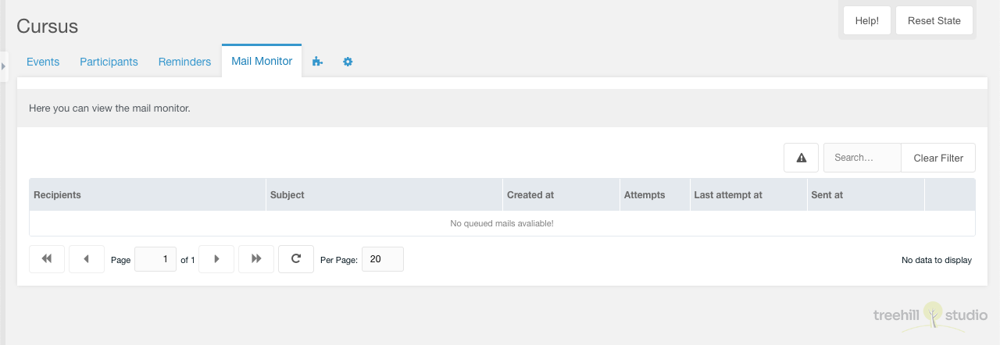
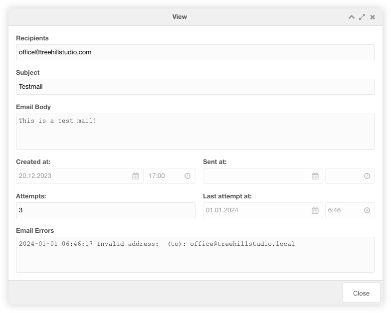

The tab contains a paginated grid with all monitored mails in the mail queue. It
is only visible if the [system setting](07_Settings.md) `cursus.queued_email` is
enabled.

The monitored mails can be filtered according to the error status of the mail
and by entering text.

The row of each monitored mail shows the recipient, the subject, the creation
date, the mail attempts, the date of the last attempt and the send date.

Each monitored mail can be viewed by clicking the view icon in the row of the
monitored mail.

## View

The view window for a monitored mail shows the fields of the mail in the
queue. If the mail cannot be sent, all mail fields, the mail information and the
error are displayed. If the mail has been sent, only the recipients, the
creation date and the send date are displayed.
