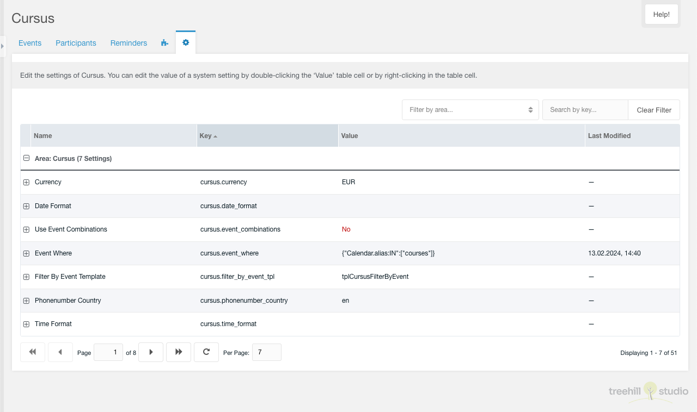

This tab contains a paginated grid with all settings of the cursus namespace. It
is only visible for a user that has the `setting` or the `cursus_settings`
permission enabled. The permission check is not executed for sudo users.

Each setting can be edited the same as in the MODX system settings panel.
